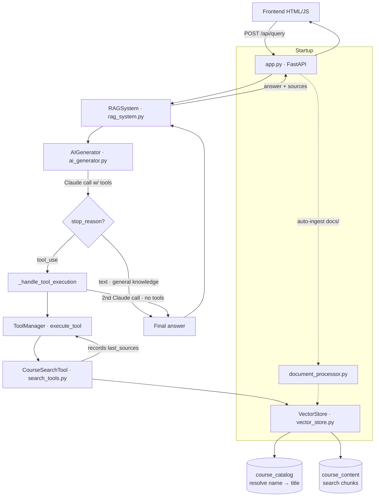

# CLAUDE.md

This file provides guidance to Claude Code (claude.ai/code) when working with code in this repository.

## Overview

Course Materials RAG (Retrieval-Augmented Generation) system: a full-stack app that answers questions about course materials using semantic search (ChromaDB) and Claude (Anthropic). FastAPI backend + static HTML/JS/CSS frontend.

## Commands

Dependencies are managed with **uv** (Python 3.13+). All Python execution goes through `uv run`.

```bash
# Install dependencies
uv sync

# Run the app (the server must run from the backend/ directory)
cd backend && uv run uvicorn app:app --reload --port 8000

# Or use the helper script (bash; use Git Bash on Windows)
./run.sh
```

App serves at `http://localhost:8000` (web UI) and `http://localhost:8000/docs` (API docs).

Requires a `.env` file in the repo root with `ANTHROPIC_API_KEY=...` (see `.env.example`).

There is no test suite, linter, or build step configured in this repo.

## Architecture

The request flow is an **agentic / tool-based RAG loop** — search is a tool Claude chooses to call, not a forced pre-retrieval step. This is the key thing to understand:



This is the key thing to understand:

1. `app.py` (FastAPI) exposes `POST /api/query` and `GET /api/courses`, serves the frontend, and on startup auto-ingests `docs/` into ChromaDB.
2. `RAGSystem` (`rag_system.py`) is the central orchestrator wiring all components together. `RAGSystem.query()` is the entry point.
3. `AIGenerator` (`ai_generator.py`) calls Claude with the search tool available. If Claude returns `stop_reason == "tool_use"`, `_handle_tool_execution()` runs the tool, feeds results back, and makes a **second** Claude call (without tools) for the final answer. General-knowledge questions skip search entirely.
4. `CourseSearchTool` (`search_tools.py`) is the tool Claude invokes. It queries the vector store and records `last_sources` for the UI. Tools are registered via `ToolManager`, which exposes definitions and dispatches `execute_tool`.
5. `VectorStore` (`vector_store.py`) wraps ChromaDB with **two collections**: `course_catalog` (course metadata, used to fuzzy-resolve a course name to its exact title via semantic search) and `course_content` (the actual chunks searched). A query first resolves `course_name` → title, then filters content by title/lesson.

### Important conventions

- **A course's title is its unique ID** in ChromaDB (catalog `ids=[course.title]`). Re-ingestion is deduplicated by title (`add_course_folder` skips titles already present).
- **Document format** (`document_processor.py`): files in `docs/` start with `Course Title:`, `Course Link:`, `Course Instructor:` header lines, then `Lesson N: <title>` markers (optionally followed by `Lesson Link:`). Chunking is sentence-based with overlap; the first chunk of each lesson is prefixed with lesson/course context for better retrieval.
- **Sessions** (`session_manager.py`) are in-memory only (lost on restart) and keep the last `MAX_HISTORY` exchanges as formatted text passed into Claude's system prompt.
- **Configuration** lives in `config.py` (`Config` dataclass): model (`claude-sonnet-4-...`), embedding model (`all-MiniLM-L6-v2`), `CHUNK_SIZE`, `CHUNK_OVERLAP`, `MAX_RESULTS`, `MAX_HISTORY`, `CHROMA_PATH`. Change behavior here, not in component constructors.
- The Claude search behavior is governed by `AIGenerator.SYSTEM_PROMPT` — notably it enforces **one search per query maximum**.

### Data models (`models.py`)

`Course` (has `lessons: List[Lesson]`, title is the identifier) → `Lesson` (number, title, link) → `CourseChunk` (content + course_title + lesson_number + chunk_index) is the unit stored in the content collection.
